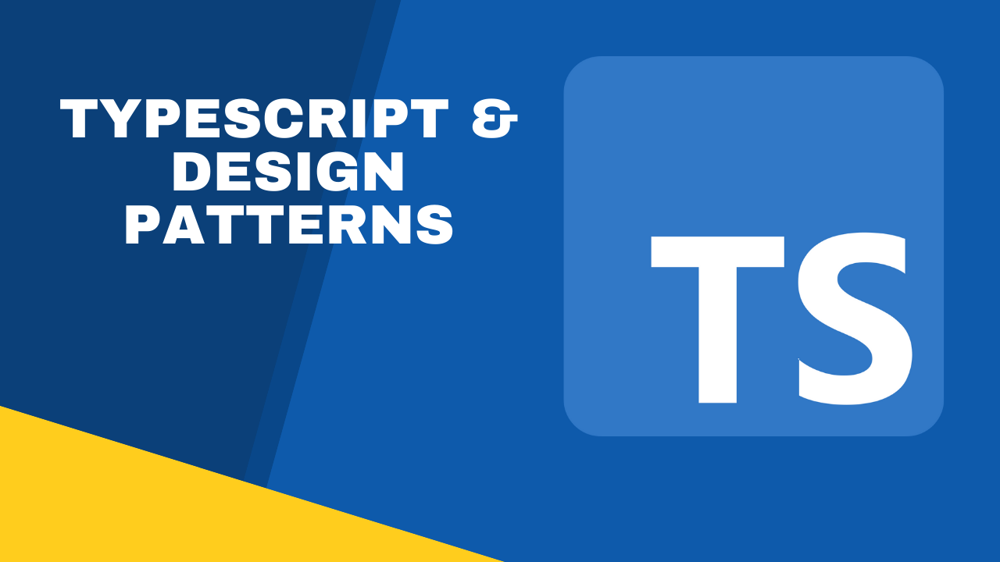

# Typescript Design Patterns

Design Patterns are solutions to ways to design applications which typically reinforces the ideas surrounding very popular programming principles such as Open-Closed principles and helping create applications and software that is scalable, adjustable, and modifiable for future modifications.

This repo is a collection of these patterns and a simplistic use case that highlights their usage along with some code that may assist with helping explain and understanding their purposes.

## Index

1. [Strategy Pattern](https://github.com/christophermlee2/TypescriptDesignPatterns/tree/main/Strategy%20Pattern)
2. [Observer Pattern](https://github.com/christophermlee2/TypescriptDesignPatterns/tree/main/Observer%20Pattern)
3. [Decorator Pattern](https://github.com/christophermlee2/TypescriptDesignPatterns/tree/main/Decorator%20Pattern)
4. [Factory Method Pattern](https://github.com/christophermlee2/TypescriptDesignPatterns/tree/main/Factory%20Method%20Pattern)
5. [Abstract Factory Pattern](https://github.com/christophermlee2/TypescriptDesignPatterns/tree/main/Abstract%20Factory%20Pattern)
6. [Command Pattern](https://github.com/christophermlee2/TypescriptDesignPatterns/tree/main/Command%20Pattern)
7. [Adapter Pattern](https://github.com/christophermlee2/TypescriptDesignPatterns/tree/main/Adapter%20Pattern)
8. [Facade Pattern](https://github.com/choicespecs/TypescriptDesignPatterns/tree/main/Facade%20Pattern)
9. [Template Pattern](https://github.com/choicespecs/TypescriptDesignPatterns/tree/main/Template%20Method)
10. [Iterator Pattern](https://github.com/choicespecs/TypescriptDesignPatterns/tree/main/Iterator%20Pattern)
11. [Composite Pattern](https://github.com/choicespecs/TypescriptDesignPatterns/tree/main/Composite%20Pattern)
12. [State Pattern](https://github.com/choicespecs/TypescriptDesignPatterns/tree/main/State%20Pattern)
13. [Proxy Pattern](https://github.com/choicespecs/TypescriptDesignPatterns/tree/main/Proxy%20Pattern)
14. [Builder Pattern](https://github.com/choicespecs/TypescriptDesignPatterns/tree/main/Builder%20Pattern)

## Description

Each Design Pattern folder will contain:

1. Readme
2. HTML, CSS, and TS files.

Readme will include detailed information on the pattern, files should be executable on a browser.

## Instructions

You can run the index.html files within each pattern and the readme will provide some detailed information for the design pattern. I've also included a Youtube video which will run through the example given and more information on the design pattern.
